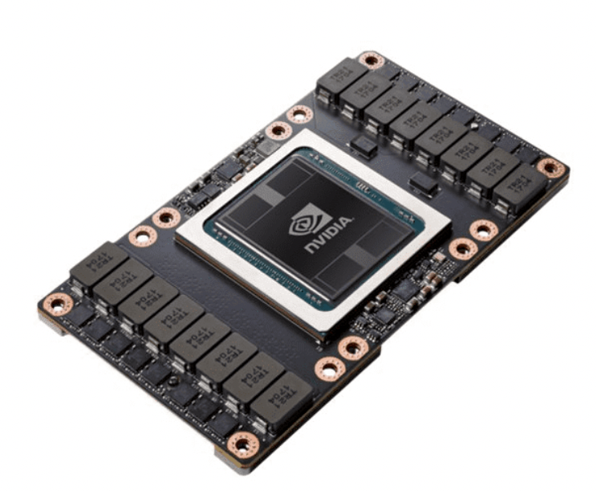

# GPU Example: Tesla V100

It's fine to have a general understanding of what graphics processing units can be used for, and to know conceptually how they work. But at the actual hardware level, what does a particular GPU consist of, if one peeks "under the hood"? Sometimes the best way to learn about a certain type of device is to consider one or two concrete examples. First we'll take detailed look at the Tesla V100, one of the NVIDIA models that has been favored for HPC applications. In a subsequent topic, we do a similar deep dive into the Quadro RTX 5000, a GPU which is found in TACC's Frontera.

# NVIDIA Tesla V100

NVIDIA Tesla V100, in the SXM2 form factor.

Some scientific applications require 64-bit "double precision" for their floating point calculations. NVIDIA was one of the first GPU manufacturers to recognize this need and meet it in 2007 through its Tesla line of HPC components. Fourteen years later, the Tesla V100 and related Volta devices could be found in 20% of all supercomputers in the [Top500 list](https://top500.org/statistics/details/accelfam/11/).

Among these systems was TACC's Frontera, which initially included a V100-equipped subsytem called "Longhorn" for supporting general-purpose GPU (GPGPU). Prior to its decommissioning in 2022, Longhorn comprised 100+ IBM nodes, each equipped with 4 NVIDIA Tesla V100s.

The Tesla V100 is a good choice for GPGPU because it contains 2560 double precision CUDA cores, all of which can execute a fused multiply-add (FMA) on every cycle. This gives the V100 a peak double precision (FP64) floating-point performance of 7.8 teraflop/s, computed as follows:

$$
2560 \, \text{FP64 CUDA cores} \times 2 \frac{\text{flop}}{\text{core} \cdot \text{cycle}} \times 1.53 \frac{\text{Gcycle}}{\text{s}} \approx 7.8 \frac{\text{Tflop}}{\text{s}}
$$

The factor of 2 flop/core/cycle comes from the ability of each core to execute FMA instructions. The V100's peak rate for single precision (FP32) floating-point calculations is even higher, as it has twice as many FP32 CUDA cores as FP64. Therefore, its peak FP32 rate it is exactly double the above:

$$
5120 \, \text{FP32 CUDA cores} \times 2 \frac{\text{flop}}{\text{core} \cdot \text{cycle}} \times 1.53 \frac{\text{Gcycle}}{\text{s}} \approx 15.7 \frac{\text{Tflop}}{\text{s}}
$$

It is interesting to compare the V100's peak FP64 rate to that of an Intel Xeon Platinum 8280 "Cascade Lake" processor on Frontera, assuming it runs at its maximum "Turbo Boost" frequency on all 28 cores, with 2 vector units per core core doing FMAs on every cycle:

$$
56 \, \text{VPUs} \times 8 \frac{\text{FP64-lanes}}{\text{VPU}} \times 2 \frac{\text{flop}}{\text{lane} \cdot \text{cycle}} \times 2.4 \frac{\text{Gcycle}}{\text{s}} \approx 2.15 \frac{\text{Tflops}}{\text{s}}
$$

Clearly, the Tesla V100 has an advantage for highly parallel, flop-heavy calculations, even in double precision.

The Volta architecture, like all NVIDIA's GPU designs, is built around a scalable array of Streaming Multiprocessors (SMs) that are individually and collectively responsible for executing many threads. Each SM contains an assortment of CUDA cores for handling different types of data, including FP32 and FP64. The CUDA cores within an SM are responsible for processing the threads synchronously by executing arithmetic and other operations on warp-sized groups of the various datatypes.

Given the large number of CUDA cores, it is clear that to utilize the device fully, many thousands of SIMT threads need to be launched by an application. This implies that the application must be amenable to an extreme degree of fine-grained parallelism.